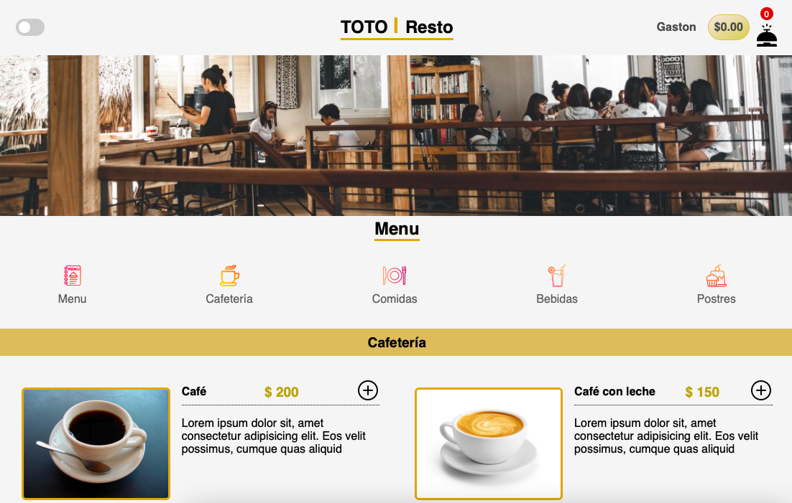

# Toto-Resto
> Sitio web con la carta del restaurante y la posibilidad de simular la compra para saber cual sera el valor del pedido con diferentes opciones de pago.
> Demo del sitio: [_Aquí_](https://toto-resto.netlify.app).

## Tabla de contenidos
* [Información General](#generalinformation)
* [Tecnologías utilizadas](#technologies-used)
* [Screenshots](#screenshots)
* [Estado del proyecto](#status)
* [Mejoras detectadas](#mejoras)
* [Contacto](#contact)

## Información General <a name="generalinformation"/>
El proyecto se enmarca dentro del aprendizaje de JavaScript a traves del curso de CoderHouse del mismo.
Se pretende poner en practica las diferentes herramientas del lenguaje aprendidads a lo largo del curso. Incluye:
- Control de flujos
- Ciclos e iteraciones mediante for y while
- Arrays
- Objetos
- Funciones y arrow functions
- Funciones de orden superior
- Local Storage y uso de JSON
- DOM
- Eventos
- Librerias
- Promises y asincronía
- Fetch y AJAX

## Tecnologías utilizadas <a name="technologies-used"/>
- HTML
- CSS
- JavaScript
- Librerias (SwiftAlert)

## Screenshots <a name="screenshots"/>

## Estado del proyecto <a name="status"/>
El proyecto se encuentra finalizado. Las diferentes versiones del mismo se citan a continuación.
- v1.0: Listo para entrega y corrección.

## Mejoras detectadas <a name="mejoras"/> 
Se reconocen las siguiente mejoras a implementar en las poteriores versiones del mismo

- Optimizacon del CSS para un mejor aspecto del modo "Oscuro"
- Implementación de la opción de pago directamente desde el sitio.
- Envio de resumen de compra al cliente mediante correo electronico o telegram.

## Contacto <a name="contact"/>
Created by [_@gastonanud_](https://www.linkedin.com/in/gaston-anud/) - Ponte en contacto conmigo!
